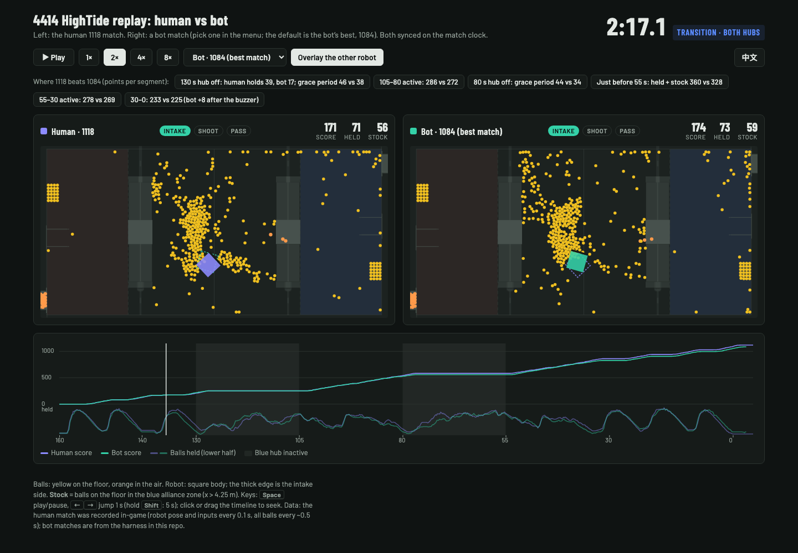

# mosim-rebuilt-bot: teaching an AI to play MoSim REBUILT (4414 HighTide), a research project that did not succeed

_Last updated: 2026-09-27_　·　**English** | [中文](README.zh-CN.md)　·　**[Replay: human 1118 vs bot](https://justaboringname.github.io/mosim-rebuilt-bot/replay/)**

The goal was a bot that drives FRC team 4414 "HighTide" in [MoSimulator](https://store.steampowered.com/app/4398690/) REBUILT (FRC 2026) on its own. It had to beat the human personal best of **1118**, ideally reaching **1200**. It did not. This document covers what was built, why every path failed, and what we learned about this game and about this kind of problem.

The work was done by Claude (Anthropic's AI) under the user's direction. Every experiment ran on one Mac Studio (M5 Max). In total it ran about 5,400 full matches in the real game, about 9,000 partial rollouts from snapshots, and about 10,000 episodes in its own simulator.

[](https://justaboringname.github.io/mosim-rebuilt-bot/replay/)

*Human 1118 (left) vs the bot's best match, 1084 (right). Click to open the interactive replay. The segment-by-segment comparison is in [Human 1118 vs bot 1084](#human-1118-vs-bot-1084-the-bots-best-match).*

## The short version

| | Score | Notes |
|---|---|---|
| Human best | 1118 | The user's own match. The other two full recorded demos scored 1085 and 1097. |
| **Final bot** | **≈ 1021** (≈ 330 matches) | A tracker that drives the human's recorded route. Best single match: 1084. |
| Target | 1200 | Not reached. Project stopped. |

**Why it failed.** The problem was not that "the game is too random to find a gradient." We measured the gradient. Around the human's route, every direction we tested went downhill or stayed flat.

1. **The human route is a tight local optimum.**
   - We measured more than a dozen ways of deviating from it or improving on it in the real game. All of them lost or were null (for example −34 ± 3, −18 ± 2.8, −0.6 ± 0.5 per match). A few early ones were single batches or single matches with large errors.
   - Two couplings are established:
     - The route hugs the edge of the ball band with a deliberate ~10° crab. A 0.6 m sideways shift misses the band. Forcing the heading to follow the travel direction cost 20 in the 80–55 dead window.
     - The strips are straight because any chassis rotation spoils the turret's aim, which stops both shots and passes (see "Turret" below).
2. **Randomness matters, in two specific ways.**
   - **Ball layouts diverge.** A few seconds after the robot first touches the balls, the bot's field no longer looks like the human's match, and the copied route "sweeps air." Over 128 control matches, the bot owned (held + stock) about 32 fewer balls than the human at 105 s and about 23 fewer at 55 s.
   - **The engine is not deterministic.** The same snapshot, restored into two instances and driven with identical inputs, differs by 8 mm after one step (with `-job-worker-count 0`; 58 mm with default threads) and is fully decorrelated after 15 s. TAS-style search ("try many times, then execute the best one") is impossible.
3. **Escaping the optimum needs a genuinely new good route, and we could not produce one.**
   - Our own simulator and static estimators were wrong exactly where it mattered:
     - For small changes around the route, the simulator got even the sign wrong: it predicted +38 / +52, and the real game gave −32 / −33.
     - For large deviations the sign was right, but the losses were underestimated by about 40%.
     - The coverage estimator correctly flagged losers, but it called a plan that lost 106 a winner.
   - Blind search in the real game is too slow at a few hundred matches per hour. A design review estimated that naive real-engine PPO would need 10⁵ or more rollouts; that figure was not measured.
   - Only human demos can supply new routes, and the existing demos are essentially one route.
4. **1200 is probably beyond this strategy's ceiling (an estimate).**
   - In the 105–80 window the human kept ≥ 20 balls aboard and scored about 12.4 balls/s.
   - A match has about 1700 feeds: ≈ 1118 shots plus ≈ 600 passes.
   - 1118 is near the ceiling for this family of play. 1200 would need a different way of moving the balls, not a better-tuned version of this one.

## Harness: getting into the game

- **Loading**
  - MoSim constructs mod prefab MonoBehaviours at startup. `tools/Injector` (Mono.Cecil) inserts one call into the constructor of a locally installed mod DLL, and that call loads `harness/MoSimRL`. We used China Modpack's `Alphabots.dll`; another mod needs a different path and type name in `install-hook.sh`.
  - Without `run/ENABLE`, the hook only loads the DLL and writes one log line. `tools/restore-hook.sh` reverts everything.
  - The installer writes this repo's `run/` path to `~/.mosimrl_run` so the in-game side can find the flag files. Bot instances also receive it as the `-mosimrl-run` launch argument.
- **Control**
  - `Bridge.cs` blocks in `FixedUpdate` until the next action arrives. It decides every 22 physics steps (0.099 s of match time) and talks TCP JSON with Python (`py/mosimrl/client.py`).
  - Driving calls `DriveController.overideInput` (field-oriented). It must be called every FixedUpdate, or the game falls back to human input.
  - The five mechanism buttons (Intake, AutoShoot, AutoPass, ManualShoot, RobotSpecial) are injected through the InputSystem (`ButtonInjector.cs`). The full button state is re-sent at every decision.
- **Speed**
  - Headless (`-batchmode -nographics`) and muted.
  - **Fixed frame step**: `Time.captureDeltaTime = 2 × fixedDeltaTime`, so every frame advances exactly two physics steps. The game then runs as fast as the CPU allows, about 4.3× realtime per instance, and load cannot change the game logic.
  - Final throughput: 20 instances with `-job-worker-count 0` and a lite state give about 348 decisions/s, 27% more than the default 16-instance setup. Python costs 0.4 ms per step and is not the bottleneck; the game's physics is.
- **Snapshot / restore**
  - `Snapshot.cs` saves a whole match by reflection: game MonoBehaviour fields, rigidbodies, joints, the managers' per-ball arrays, statics and `Random.state`, gzipped and base64-encoded.
  - A snapshot restores into another instance, which enables real-engine lookahead (`py/mosimrl/planner.py`).
  - Gotcha: locked joints must be re-anchored after a restore, or the intake stops working.
  - Restores are faithful in aggregate but not ball-for-ball (see "Chaos and determinism").
- **No leaderboard uploads.** Whenever `run/BRIDGE` (or `run/PROBE`) exists, the harness sets the game's `wasCheated` to true in every Update, FixedUpdate and LateUpdate, so bot matches never upload. gamectl creates that flag when it launches bots. Recording a human demo (RECORD only) is left alone, and human scores upload as usual.
- **Hygiene.** Instances start with `-mosimrl-owner <pid>` and quit within about 2 s after that process exits, so no orphans are left behind.

## Baseline: follow the human's demo (ghost tracker)

`py/mosimrl/ghost_policy.py` follows the human match's trajectory, heading and buttons on the match clock. Position control is PD plus the human's stick as feed-forward.

| Version | Mean | Key change |
|---|---|---|
| First scripted policy | 148 / 139 | Stuck on the bump crest and walls; the user then recorded demos |
| Tracker + opening fixes | 895 → 931 | Deploy the intake only after clearing the trench bar |
| CMA-ES over 10 tracker gains | 1004 ± 23 | Lookahead 0.15 → 0, position gain 1.2 → 1.8 |
| Physics-step clock | 1009 ± 22 | The game timer ticks per rendered frame, so a stall made several decisions see the same t |
| Fixed-frame-step mode | ≈ 998–1004 | Runs at CPU speed; a change of harness, not an improvement |
| **Heading timing `yaw_dt = 0.2`** | **≈ 1022–1027** | Headings led turns by 10–20°; running the heading on a clock 0.2 s later gave +25 (3.5 SE) over the fixed-step baseline |

The changes that helped all came from **diagnosing execution errors**, not from search.

## Directions tried and rejected by the real game

Rule, from the MiniSim RL candidate c50 onward: every experiment's acceptance criterion was written in `docs/research-log/proposals.md` before it ran. Results come from interleaved paired A/B in the real game, and a gain counts only above 2 SE. Earlier attempts were not pre-registered: the first five rows, real-engine MPC and intake pulsing. The MPC and route-switch results are single matches.

| Direction | Idea | Prediction | Real result | Why it failed |
|---|---|---|---|---|
| Greedy lateral offset / RL residual (early) | Lean toward more balls | — | 781 vs 920 | The route hugs the edge of the ball band; 0.6 m off misses it (36 vs 80 held at 106 s) |
| CMA shifts of dead-window segments | Translate whole segments | — | ≈ 800 vs 1025 | Same |
| Route splicing (1118 → 1097 → 1118) | Borrow a segment from another demo | — | 788 vs 897 (same-batch control) | The target area had already been swept by the other route |
| Free ball seeking | Go where the balls are | — | 751 / 878 | Got stuck and broke the sweep order |
| Smoothly bent routes (bump1) | Bends chosen by an offline swath model | Gain | 869 vs 1007 | Stole the pile the next trip would sweep; 7× the unsticks. A whole-window joint model got the sign right but underestimated the loss about 3× |
| **MiniSim + PPO** | Rewrote the 3D ball physics with PhysX parameters and re-implemented the match logic from the game's behaviour, then ran RL inside it | Sim +38 / +52 | **−32 / −33** | For small changes around the route the simulator got the sign wrong, even at a 5 cm mean offset |
| Real-engine MPC (snapshot lookahead) | Every 2 s, roll out candidates from a snapshot and pick the best | — | Single matches: dead-window MPC 987 (baseline ≈ 998), active-window MPC 892 | A 12 s horizon is too short; the losses land beyond it |
| Switching among human routes | 3 human routes plus mirrors (6), chosen by rollouts | — | Single match m3: every switch candidate's rollout was 27–71 worse than tracking; 0 switches (1031) | The demos are nearly the same route |
| Pulsing Intake while shooting | The user's tip | — | −26 to −43 | The human only does it at window ends, which the tracker already copies |
| Intake-first heading (IF) | Point the intake along the path | — | −20 in the 80–55 dead window | The human's ~10° crab is deliberate |
| Ball-aware local steering (LBS) | Every 0.1 s, pick the local move that captures the most | Local gain | −34 owned in 130→105 (full matches 881 vs 1014, lateral-only variant) | Coverage gaps: about 50 more neutral balls left at 105 s, about 25 more at 55 s |
| Pile registration (REG) | Translate each human strip onto where its balls are now | — | −24 owned in 130→105 | Same |
| **Whole-window coverage re-planning (CR)** | Static-field estimator plus beam search over the actual balls | Estimator +25 | **−106 owned in 130→105** (selective variant −89; full matches 886 vs 1016) | The plan turned constantly: the turret lost aim, the hopper sat at 90–100 and stopped taking balls |
| Yaw-rate cap while shooting (ys60) | The turret shoots faster when the chassis is still | Screen +6.9 | **−18.3** (1003.9 vs 1022.2, 128 each) | The screen valued owned balls at 1.0, a proxy hack; real scoring fell, mechanism not identified |
| **Real-engine option learning (OL)** | Randomize "cap rotation in turns while shooting" and "hold passes before 55 s", then learn a conditional policy from ≈ 4000 real rollouts | — | Cross-fitted value **−0.6 ± 0.5 per match** (bar: +5) | The model predicts where capping hurts more or less, never where it helps; holding was null |

- LBS, REG and CR were screened only in the first dead window (130→105). Their unit is owned balls (held + stock) at the window end, not points.
- The engine was also checked for determinism, and it is not deterministic, so TAS-style search is out. That was a check, not an A/B.
- Two logged exceptions: CR went to the real game after its pre-registered kill, at the user's request. OL's first harness check required a heading-recovery rate ≥ 0.90, measured 0.80, and was let through.

## What we learned about the game

**Scoring**
- One point per ball, counted on passage through the hub, with a 1.5 s debounce per ball. 4414 has no climber, so all points are fuel.
- Balls still count for **3 s** after a hub turns off. The human keeps shooting about 1.3 s past each off edge, worth 44–46 points each time in the 1118 match.
- `run_ghost`'s per-window table misses points scored after the buzzer (mean ≈ 24, 5–95% range 8–35). Add them back before comparing windows.

**Intake (4414)**

With the slide fully out (≥ 0.29 m), capture probability by the ball's lateral offset from the centreline:

| Lateral offset | Capture |
|---|---|
| ≤ 0.30 m | 0.95–0.98 |
| 0.30–0.35 m | ≈ 0.80 |
| 0.35–0.40 m | ≈ 0.6 |
| 0.40–0.45 m | 0.35–0.48 |
| beyond (to 0.555 m) | ≈ 0.15, mostly pushed away by the front corner |

- Balls first touched at a front corner are captured 0.38 of the time overall. Speed has no measurable effect.
- Holding AutoShoot or AutoPass without Intake retracts the slide to about 0.19–0.25 m, and about 70% of the balls met are pushed away.
- Capture falls to 0.80 with ≥ 81 balls held and to 0.56 with ≥ 96.
- In the control's 130→105 window, about 38 balls per match were touched but not taken and about 16 were moved by chain pushes (80→55: 45 / 12).

**Turret vs chassis rotation (the most important finding)**

Control matches, AutoShoot held, ≥ 20 balls aboard, inside our zone:

| Chassis yaw rate | Share of shooting time | Launches/s | Turret error |
|---|---|---|---|
| < 20°/s | 55% | 16.7 | 0.22 |
| 20–60°/s | 26% | 16.1 | — |
| 60–120°/s | 14% | 13.7 | 0.51 |
| > 120°/s | 4% | 4.0 | 1.27 |

- When the chassis turns, the turret error grows and the feed gate holds the shots. Passing (AutoPass) behaves the same way: about 20/s driving straight, 2–6/s above 120°/s.
- This is why CR lost so badly. Its plan kept turning, the hopper stayed at 90–100, and about 110 fewer balls left the neutral zone.
- The table is a correlation, but a rising turret error is exactly the condition under which the feed gate holds.
- Capping rotation by force **also loses** (ys60, OL), and we never identified why: under ys60 the robot ended windows with more balls and scored fewer.

**The value of an owned ball (calibrate window scores)**

One ball held or in stock at a window end, converted into later points:

| Time | Value of one owned ball |
|---|---|
| 105 s | 0.6–0.8 |
| 80 s | ≈ 0.35 (0.24–0.43) |
| 55 s | ≈ 0.55 (held ≈ 0.7, stock ≈ 0.4) |
| 30 s | ≈ 0 |

Counting owned balls at 1.0 is a proxy an optimizer will exploit; that is how ys60 passed its screen.

**Chaos and determinism**
- Two bot matches with the same policy: 10 s after the first sweep, only about 38% of floor balls still match within 5 cm.
- The same snapshot in two instances with identical inputs: the robot differs by 8 mm after one step, and balls differ by up to 11 m after 15 s. Restoring twice in the same instance diverges too.
- From one snapshot, 22 s rollouts have an SD of about 6.6 owned balls (held + stock, mean ≈ 371), or about 8.3 counting only held balls. Independent full matches have a score SD of about 23.

**Human 1118 vs bot 1084 (the bot's best match)**

| Segment | Human | Bot | Diff |
|---|---|---|---|
| Auto + 140–130 | 207 | 214 | +7 |
| Grace after the 130 s hub-off | 46 | 38 | −8 |
| 105–80 active | 286 | 272 | −14 |
| Grace after the 80 s hub-off | 44 | 34 | −10 |
| 55–30 active | 278 | 269 | −9 |
| 30–0 | 233 | 225 | −8 |
| After the buzzer | 24 | 32 | +8 |

- At 130 s the human held 39 balls and the bot 17, so the bot had fewer to shoot during the grace period.
- In the dead windows the human cleared 85% / 81% of the neutral floor balls on the same route. This bot match cleared 82% / 75%, and the control mean (8 matches) was 75% / 75%.
- Watch both side by side on the [replay page](https://justaboringname.github.io/mosim-rebuilt-bot/replay/), which has buttons that jump to these moments.

## Methodological lessons

1. **Simulators can get the sign of small changes wrong.** MiniSim matched the plain route's total within about 20 points, yet predicted the wrong direction for residuals of about 5 cm. Before training a residual policy in a simulator, check in the real game that it ranks such changes correctly.
2. **Back-test estimators on cases they call wins**, not only on cases they call losses. CR's estimator correctly flagged LBS as a loss, then called a 106-ball loss a gain.
3. **Screen metrics get gamed.** Counting owned balls at 1.0 at a window end rewards hoarding over scoring. Calibrate the value against realized later points, and let only full-match scores decide.
4. **Pairing can manufacture signals.** Pairing rollouts by completion order selects the fast ones, which have fewer balls and lower scores. Pair by submission order.
5. **Write acceptance and kill criteria first.** From c50 on, every direction was stopped by its own rule, and no bar was moved afterwards (two logged exceptions above).
6. **"100% CPU" is not full load.** When the sampler under-dispatched, half the instances sat idle while the system still looked 100% busy. Measure decisions/s, not utilization.

## If someone wants to continue

- Most promising: **record human demos with genuinely different dead-window routes.** This is the one lever that has not been tested; the existing demos are essentially one route.
- **Deep RL with path actions in the real game** would cost days of compute and has a low prior.
- Already measured, so not worth retrying:
  - local deviations from the human route (offsets, shifts, bends, seeking, registration);
  - small execution-level levers that keep the route (rotation caps, holding passes, pulsing).

## Repository layout

| Path | Contents |
|---|---|
| `harness/MoSimRL/` | In-game C#: `Bridge.cs` (control / state / snapshot protocol), `Snapshot.cs` (whole-match save/restore), `ButtonInjector.cs`, `Recorder.cs` (records human demos), `Probe.cs` (entry point, flag files, upload guard) |
| `tools/` | `Injector/` (Cecil hook), `install-hook.sh` / `restore-hook.sh`, `replay-viewer.html` (page template used by `mosimrl/replay.py`) |
| `py/mosimrl/` | Python side: `gamectl` (launch and manage instances), `client`, `ghost` / `ghost_policy` (tracker), `run_ghost` (A/B batches), `planner` (snapshot rollouts, MPC, screens), `coverage` (CR), `optlearn` / `optfit` (real-engine option learning), `bench`, `detcheck`, `replay` |
| `py/minisim/` | MiniSim: PhysX-parameter ball physics plus a re-implementation of the match logic, PPO (`rl.py`) and calibration scripts |
| `docs/replay/` | Side-by-side replay page (English / Chinese, GitHub Pages) |
| `docs/research-log/` | Full experiment log: `STATUS.zh.md` (progress log, Chinese) and `proposals.md` (pre-registered criteria, results and supplementary measurements, English) |
| `run/demos/demo-20260926-015440-m1.jsonl` | The human 1118 match: one line per 0.1 s with robot pose, stick and buttons, plus all ball positions about every 0.5 s. The tracker drives this. Other demos are not published. |

- **Game-derived data included.** `py/minisim/field_obbs.json` and `robot_obstacles.json` hold collider dimensions read from the game's field scene (numbers only); the replay page's field outline comes from them. `hit_table.json` and `launch_table.json` are our own measurements.
- **Not included.** Any game or mod code, decompiled sources, binaries, art assets, and about 16 GB of experiment data. `runs/`, `docs/design/` and `docs/policy-facts/`, which code comments and the logs mention, are unpublished working files.

## Running it

You need:
- macOS;
- the Steam build of MoSimulator 26.4.1 (REBUILT exists only there);
- a locally installed mod to hook;
- the .NET SDK (to build the harness and injector);
- Python 3.11 with `requirements.txt`.

```bash
dotnet build harness/MoSimRL -c Release   # builds harness/bin/MoSimRL.dll
tools/install-hook.sh                      # quit the game first; undo with tools/restore-hook.sh
touch run/ENABLE
cd py && python -m mosimrl.run_ghost --demo ../run/demos/demo-20260926-015440-m1.jsonl --ports 47500,47501 \
    --episodes 4 --time-scale 1 --steps-per-frame 2 --game-args "-job-worker-count 0"
python -m mosimrl.replay ../runs/ghost/<batch>/<match>.json --out /tmp/data.js   # replay data
```

- To record a human demo, `touch run/ENABLE run/RECORD` and play a match normally from Steam. It is written to `run/demos/`.
- Bot matches always run headless and muted, and never upload.
- Before publishing, we changed how the in-game side finds `run/`: it was hard-coded to the author's path. The new code was compile-checked but not re-run in the game.

## Disclaimer

- MoSimulator belongs to its developers. This project is not affiliated with them and contains no game code or art assets.
- This is a personal research project under the MIT license.
- The code and documents were written by Claude (Anthropic) under the user's direction.
